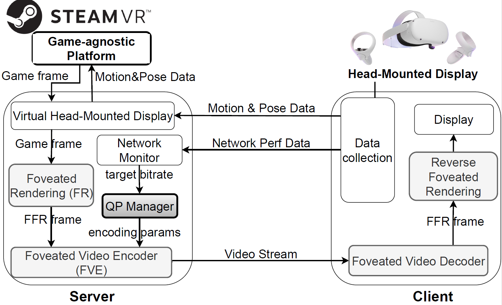
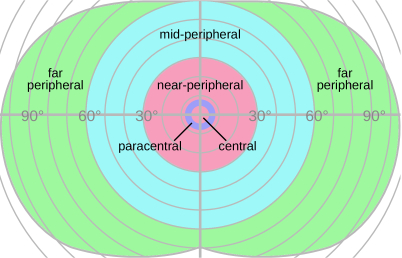
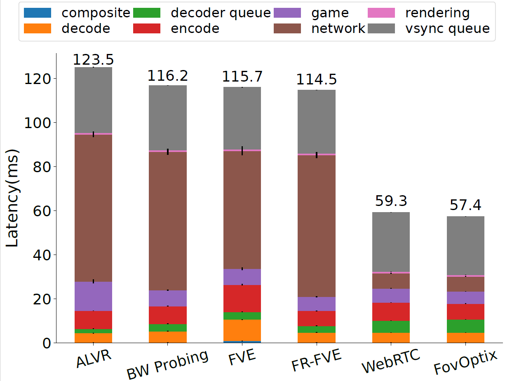
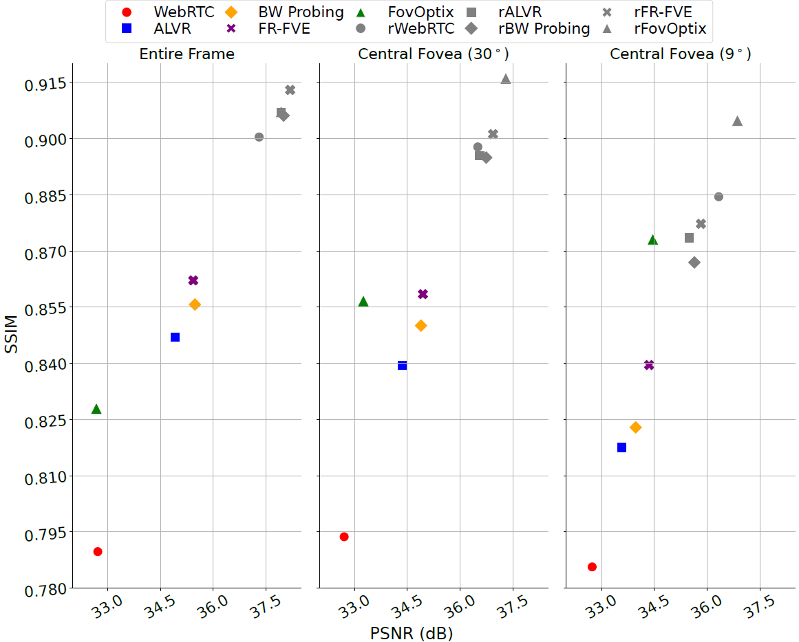

# FovOptix
[FovOptix: Human Vision-Compatible Video Encoding and Adaptive Streaming in VR Cloud Gaming](https://dl.acm.org/doi/abs/10.1145/3625468.3647612)

FovOptix is developed based on [ALVR code base](https://github.com/alvr-org/ALVR).  
ALVR streams VR games from your PC to your VR headset via Wi-Fi.  
Please read more details about the supported VR Headsets, PC OS, requirements, and tools required on [ALVR](https://github.com/alvr-org/ALVR).

## Build from source

You can follow the guide [here](https://github.com/alvr-org/ALVR/wiki/Building-From-Source).

## System Architecture

We implemented **Fixed-Foveated Video Encoder** that encodes the rendered game frame in compitability with human vision system. 
Inspired by the perception in human vision system (Figure below), central field-of-view (FoV) region is encoded with higher quality, lower quality in mid-peripheral FoV region, and the lowest in the periphery.

The **Network Monitor** module feed network performance metrics to the **Quality Manager** module to allocate qualities for these region adaptively according to the network conditions. This module outputs the encoding parameters (i.e., target bitrate) so that the sending bitrate adapts to the available bandwidth.
## System Performance 
### Motion-to-photon Latency and visual quality (PSNR and SSIM)

### Visual Quality (PSNR and SSIM)

### Quality of Experience (QoE)
We recruited participants to play The Lab VR Game,  after dividing them into two groups.
The first group played FPS game (Longbow), while the second group played TPS game (Xortex). 

Overall, **FovOptix** exhibits the lowest motion-to-photon latency, and highest visual quality in region of interest (foveal region).
**FovOptix** exhibits highest playability and VQ in FPS game. However, **WebRTC** outperform **FovOptix** in TPS game in terms of visual quality due to the fixed nature of assigning the quality to the central FoV region.
